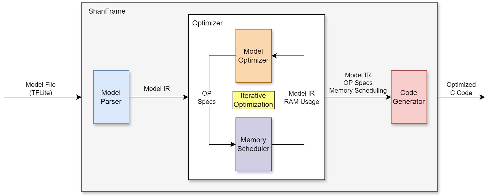

# ShanFrame

ShanFrame is an **TinyAI model compiler** for **MCU devices**. It takes a tflite model, target MCU architecture, target SRAM and Flash size as inputs, and generates optimized C code, so that it the latency will be minimized while satisfying the limit.

## Overview

    

According to the target specs, ShanFrame generates a list of optimization options in each iteration. Each optimization option has its SRAM/Flash overhead and latency benefit. According to a policy set in `Optimizor`, ShanFrame applies one optimization option that fits within spec limits. This iteration continues until there is no appliable options.

ShanFrame has the following characteristics compared to other AI compilers:
- **Trade space for speed**: With more specific target binary size and SRAM usage, ShanFrame is allowed to apply more efficient and more aggressive optimizations to speedup the workload.
- **Utilize compile-time information**: Different from other workloads, AI workload is very predictable as most computation parameters are known at compile time. Since most MCUs are not equipped with accelerators, execution on CPU allows ShanFrame to utilize partial evaluation and constant propagation for further optimization.

## Code Structure

`shan_frame` contains the main package of ShanFrame to compile TFLite model into optimized C code.

`example` contains example TFLite models for evaluation and demonstration.

`assets` contains misc assets.

`.vscode` contains dev IDE settings.

## Requirement

- Python 3.11+

## Setup and Run

TBA

## Coding Style

This project follows [Python Code Style Guide](https://peps.python.org/pep-0008/), with following notes. These ensures the code is easily understandable for maintainence. 

- [Type hints](https://docs.python.org/3/library/typing.html): Use as much as type hints so that every variable has known type. 
- Type Checking: If using [Visual Studio Code](https://code.visualstudio.com/) as IDE, use [Pylance](https://marketplace.visualstudio.com/items?itemName=ms-python.vscode-pylance) extension and make sure the new code passes `typeCheckingMode: standard`. 
